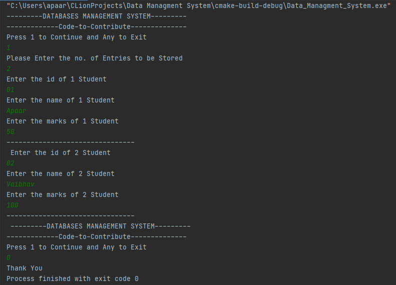

# Data Managment System
This is File Handling based project on C language a user can store data into a text using this i have used 
Struture array to store data and the print it into File, Also it pick current date and time from system while storing data 
to maintain record properly.
  -Project is made on Clion
  -CUI Project
  -main.c file contains whole code.
# How to Use
 -Fork this Repository 
 -Make changes accordingly
 -Commit and Push
 -Enjoy!!!
# Preview
[]
